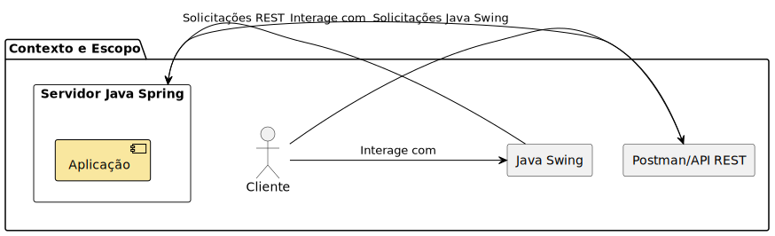
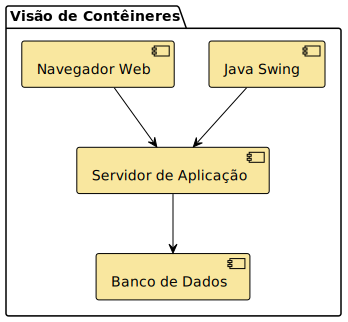
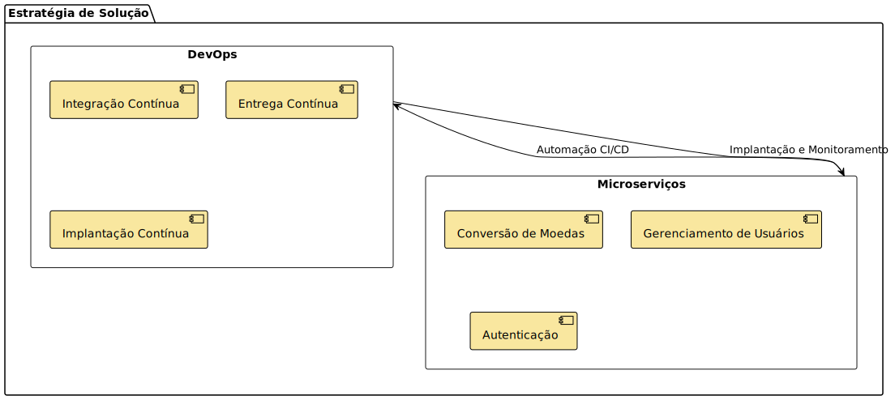
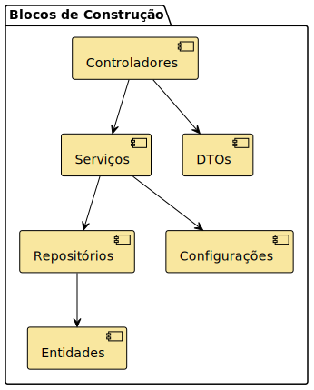
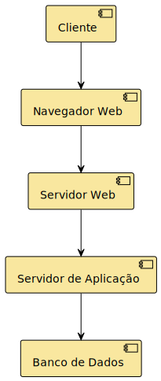
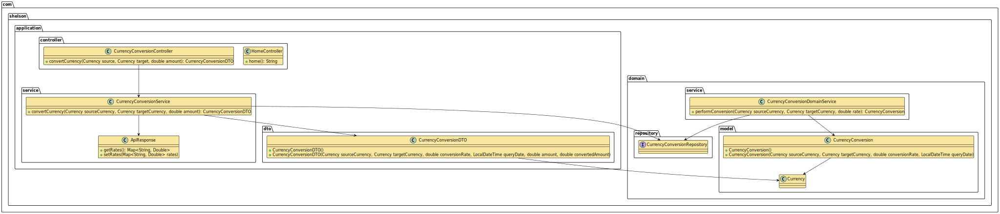

# Project Architecture Documentation

## Overview

### Description

The project is a currency conversion API based on Spring Boot. It utilizes Domain-Driven Design (DDD) to structure the code, facilitating system maintenance and scalability.

### Objectives

- Provide an API for currency conversion.
- Use software design best practices, such as DDD, to ensure modular and easily extensible code.

## Software Architecture

### Architecture Layers

The project's architecture is divided into several layers, each with specific responsibilities:

1. **Presentation Layer**:
   
   - Responsible for handling HTTP requests and returning responses.
   - Implemented using Spring Boot controllers.

2. **Application Layer**:
   
   - Contains the system's use cases.
   - Orchestrates application logic but does not contain business logic.

3. **Domain Layer**:
   
   - The heart of the system, containing business rules and core logic.
   - Includes entities, aggregates, repositories, and domain services.

4. **Infrastructure Layer**:
   
   - Handles data persistence, integration with external services, and other technical concerns.
   - Contains repository implementations and database configurations.

## Layer Details

### Presentation Layer

**Controlador (Controller)**

```java
/**
 * Controller responsible for currency conversion operations.
 * Provides endpoints for converting values between different currencies.
 */
@RestController
@RequestMapping("/api/v1/conversions")
@Api(value = "Currency Conversion Controller", description = "Currency conversion operations")
public class CurrencyConversionController {

    @Autowired
    private CurrencyConversionService currencyConversionService;

    /**
     * Converts the source currency to the target currency.
     * 
     * @param source The source currency. Example: USD.
     * @param target The target currency. Example: BRL.
     * @param amount The amount to be converted. Example: 100.0.
     * @return A {@link CurrencyConversionDTO} containing the conversion details.
     * @throws BusinessException 
     */
    @GetMapping("/convert")
    @ApiOperation(value = "Converts the source currency to the target currency", notes = "Returns the currency conversion details")
    @ApiResponses(value = {
            @ApiResponse(code = 200, message = "Successful operation", response = CurrencyConversionDTO.class),
            @ApiResponse(code = 400, message = "Invalid input")
    })
    public CurrencyConversionDTO convertCurrency(
            @RequestParam @ApiParam(value = "Source currency", example = "USD") Currency source, 
            @RequestParam @ApiParam(value = "Target currency", example = "BRL") Currency target,
            @RequestParam @ApiParam(value = "Amount to be converted", example = "100.0") double amount) throws BusinessException {
        return currencyConversionService.convertCurrency(source, target, amount);
    }
}
```

### Application Layer

**Application Service**

```java
@Service
public class CurrencyConversionService {
    @Autowired
    private CurrencyConversionDomainService domainService;

    public CurrencyConversionDTO convert(String source, String target, double amount) {
        return domainService.convert(source, target, amount);
    }
}
```

### Domain Layer

**Domain Entity**

```java
@Entity
@Table(name = "CURRENCY_CONVERSIONS")
public class CurrencyConversion {
    @Id
    @GeneratedValue(strategy = GenerationType.IDENTITY)
    private Long id;

    @Enumerated(EnumType.STRING)
    @Column(name = "source_currency")
    private Currency sourceCurrency;

    @Enumerated(EnumType.STRING)
    @Column(name = "target_currency")
    private Currency targetCurrency;

    @Column(name = "conversion_rate")
    private double conversionRate;

    @Column(name = "query_date")
    private LocalDateTime queryDate;

    public CurrencyConversion(Currency sourceCurrency, Currency targetCurrency, double conversionRate, LocalDateTime queryDate) {
        this.sourceCurrency = sourceCurrency;
        this.targetCurrency = targetCurrency;
        this.conversionRate = conversionRate;
        this.queryDate = queryDate;
    }
}
```

### Infrastructure Layer

**Repository**

```java
public interface CurrencyConversionRepository extends JpaRepository<CurrencyConversion, Long> {
}
```

**Database Configuration**

```yaml
spring:
  datasource:
    url: jdbc:h2:mem:testdb
    driverClassName: org.h2.Driver
    username: sa
    password: password
  h2:
    console:
      enabled: true
  jpa:
    hibernate:
      ddl-auto: update
    show-sql: true
```

## Diagrams

### Project Context and Scope



### Container View



### Solution Strategy



### Building Blocks View



### Runtime View


### Deployment View



## Currency Conversion Class Diagram



## 4. Conclusion

The architecture of this project is designed to be modular and scalable, using DDD practices to organize and structure the code. This approach facilitates system maintenance and allows new features to be added efficiently and in an orderly manner.

- [README](./README.md)

---

## Wiki Menu

[Home Page](/README.md)

### 1. Introduction to the Project
- [Overview](https://github.com/33mestre/java_base/wiki/overview): Presentation of the project, highlighting its purpose and the context in which it is embedded.
- [Project Objectives](https://github.com/33mestre/java_base/wiki/project-objectives): Enumeration of the main objectives that the project aims to achieve.
- [Scope and Functionalities](https://github.com/33mestre/java_base/wiki/scope-and-functionalities): Description of the main functionalities offered by the project and its scope of operation.

### 2. Configuration and Installation
- [Initial Configurations](https://github.com/33mestre/java_base/wiki/initial-configurations): Steps required to set up the development or production environment.
- [Installation Instructions](https://github.com/33mestre/java_base/wiki/installation-instructions): Detailed procedures for installing the project in different environments.
- [Docker Configuration](https://github.com/33mestre/java_base/wiki/docker-configuration): Specifications on how to configure and use Docker for the project.

### 3. Project Structure
- [Folder Structure](/DIRECTORY.md): Description of the organization of the project directories.
- **Project Architecture**.

### 4. Development
- [Development Flow](https://github.com/33mestre/java_base/wiki/development-flow): Description of the development process adopted, including planning, coding, and review stages.
- [Apache Camel Integration](https://github.com/33mestre/java_base/wiki/apache-camel-integration): Guide on integrating Apache Camel into the project, including configuration and usage.
- [Contributors and Authors](/AUTHORS.md): Recognition of the contributors to the project.
- [Contributions](/CONTRIBUTING.md): Guidelines on how to contribute to the project, including code standards and pull request requirements, tips and best practices.
- [Code of Conduct](/CODE_OF_CONDUCT.md): Behavioral guidelines expected for the project community.

### 5. API and Documentation
- [OpenAPI Specification](https://github.com/33mestre/java_base/wiki/openapi-specification): Details about the OpenAPI specification used to document the API endpoints.
- [API Documentation with Swagger](https://github.com/33mestre/java_base/wiki/api-documentation-with-swagger): Information on how to access and use the interactive API documentation generated by Swagger.
- [Javadoc Documentation](https://github.com/33mestre/java_base/wiki/javadoc-documentation): Information on the Javadoc documentation generated for the project.

### 6. Endpoints and Database
- [Endpoint Description](https://github.com/33mestre/java_base/wiki/endpoint-description): Details of the available API endpoints, including methods, parameters, and usage examples.
- [Database Management](https://github.com/33mestre/java_base/wiki/database-management): Strategies and practices for efficient management of the database used by the project.

### 7. Testing
- [Testing Strategies](https://github.com/33mestre/java_base/wiki/testing-strategies): Approach and methods used to test the software, including unit, integration, and E2E tests.
- [Testing Tools](https://github.com/33mestre/java_base/wiki/testing-tools): Description of the testing tools used in the project and how to configure them.

### 8. CI/CD and Automations
- [CI/CD Pipeline](https://github.com/33mestre/java_base/wiki/ci-cd-pipeline): Explanation of the continuous integration and delivery pipeline, detailing each stage and its function.
- [Automations and Artifact Generation](https://github.com/33mestre/java_base/wiki/automations-and-artifact-generation): Description of the automations incorporated into the CI/CD, including documentation generation and build artifacts.

### 9. Configuration Files
- [.gitignore, .editorconfig and project.properties](https://github.com/33mestre/java_base/wiki/gitignore-and-editorconfig-and-project-properties): Utility of these files to maintain code consistency and quality.
- [Maven Wrapper and application.properties](https://github.com/33mestre/java_base/wiki/maven-wrapper-and-application-properties): Explanation of how these files help standardize the development environment.
- [.env File and Travis CI Settings](https://github.com/33mestre/java_base/wiki/env-file-and-travis-ci-settings): Use of these files to configure the environment and CI integrations.

### 10. Best Practices
- [Code Standards and Security](https://github.com/33mestre/java_base/wiki/code-standards-and-security): Guidelines for maintaining code quality and security.
- [Monitoring and Logging Practices](https://github.com/33mestre/java_base/wiki/monitoring-and-logging-practices): Recommended techniques for monitoring and logging in the project.

### 11. Legal and Licensing
- [Licensing](https://github.com/33mestre/java_base/wiki/licensing): Information about the rights and restrictions associated with the use of the software.
- [Terms of Use](https://github.com/33mestre/java_base/wiki/terms-of-use): Information about the terms and conditions for using the software.

### 12. Projections and Innovations
- [Future Plans](/FUTURE.md): Discussion on functionalities and improvements considered for future versions of the project.
- [Improvement Proposals](https://github.com/33mestre/java_base/wiki/improvement-proposals): Space for the community to suggest and debate improvements and innovations.

### 13. Attachments and Useful Links
- [External Links and References](https://github.com/33mestre/java_base/wiki/external-links-and-references): Additional resources and external documentation relevant to the project.

### 14. Security
- [Security Policy](/SECURITY.md): Details on the supported versions, reporting vulnerabilities, and general security practices.
