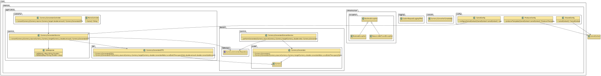

# Project Architecture Documentation

## Overview

### Description

The project is a currency conversion API based on Spring Boot. It utilizes Domain-Driven Design (DDD) to structure the code, facilitating system maintenance and scalability.

### Objectives

- Provide an API for currency conversion.
- Use software design best practices, such as DDD, to ensure modular and easily extensible code.

## Software Architecture

### Architecture Layers

The project's architecture is divided into several layers, each with specific responsibilities:

1. **Presentation Layer**:
   
   - Responsible for handling HTTP requests and returning responses.
   - Implemented using Spring Boot controllers.

2. **Application Layer**:
   
   - Contains the system's use cases.
   - Orchestrates application logic but does not contain business logic.

3. **Domain Layer**:
   
   - The heart of the system, containing business rules and core logic.
   - Includes entities, aggregates, repositories, and domain services.

4. **Infrastructure Layer**:
   
   - Handles data persistence, integration with external services, and other technical concerns.
   - Contains repository implementations and database configurations.

## Layer Details

### Presentation Layer

**Controlador (Controller)**

```java
/**
 * Controller responsible for currency conversion operations.
 * Provides endpoints for converting values between different currencies.
 */
@RestController
@RequestMapping("/api/v1/conversions")
@Api(value = "Currency Conversion Controller", description = "Currency conversion operations")
public class CurrencyConversionController {

    @Autowired
    private CurrencyConversionService currencyConversionService;

    /**
     * Converts the source currency to the target currency.
     * 
     * @param source The source currency. Example: USD.
     * @param target The target currency. Example: BRL.
     * @param amount The amount to be converted. Example: 100.0.
     * @return A {@link CurrencyConversionDTO} containing the conversion details.
     * @throws BusinessException 
     */
    @GetMapping("/convert")
    @ApiOperation(value = "Converts the source currency to the target currency", notes = "Returns the currency conversion details")
    @ApiResponses(value = {
            @ApiResponse(code = 200, message = "Successful operation", response = CurrencyConversionDTO.class),
            @ApiResponse(code = 400, message = "Invalid input")
    })
    public CurrencyConversionDTO convertCurrency(
            @RequestParam @ApiParam(value = "Source currency", example = "USD") Currency source, 
            @RequestParam @ApiParam(value = "Target currency", example = "BRL") Currency target,
            @RequestParam @ApiParam(value = "Amount to be converted", example = "100.0") double amount) throws BusinessException {
        return currencyConversionService.convertCurrency(source, target, amount);
    }
}
```

### Application Layer

**Application Service**

```java
@Service
public class CurrencyConversionService {
    @Autowired
    private CurrencyConversionDomainService domainService;

    public CurrencyConversionDTO convert(String source, String target, double amount) {
        return domainService.convert(source, target, amount);
    }
}
```

### Domain Layer

**Domain Entity**

```java
@Entity
@Table(name = "CURRENCY_CONVERSIONS")
public class CurrencyConversion {
    @Id
    @GeneratedValue(strategy = GenerationType.IDENTITY)
    private Long id;

    @Enumerated(EnumType.STRING)
    @Column(name = "source_currency")
    private Currency sourceCurrency;

    @Enumerated(EnumType.STRING)
    @Column(name = "target_currency")
    private Currency targetCurrency;

    @Column(name = "conversion_rate")
    private double conversionRate;

    @Column(name = "query_date")
    private LocalDateTime queryDate;

    public CurrencyConversion(Currency sourceCurrency, Currency targetCurrency, double conversionRate, LocalDateTime queryDate) {
        this.sourceCurrency = sourceCurrency;
        this.targetCurrency = targetCurrency;
        this.conversionRate = conversionRate;
        this.queryDate = queryDate;
    }
}
```

### Infrastructure Layer

**Repository**

```java
public interface CurrencyConversionRepository extends JpaRepository<CurrencyConversion, Long> {
}
```

**Database Configuration**

```yaml
spring:
  datasource:
    url: jdbc:h2:mem:testdb
    driverClassName: org.h2.Driver
    username: sa
    password: password
  h2:
    console:
      enabled: true
  jpa:
    hibernate:
      ddl-auto: update
    show-sql: true
```

## Diagrams

### Project Context and Scope


### Container View


### Solution Strategy


### Building Blocks View


### Runtime View


### Deployment View


## Currency Conversion Class Diagram



## 4. Conclusion

The architecture of this project is designed to be modular and scalable, using DDD practices to organize and structure the code. This approach facilitates system maintenance and allows new features to be added efficiently and in an orderly manner.

- [README](./README.md)

---

## Wiki Menu

- [Presentation](https://github.com/33mestre/java_base/wiki/presentation)
- [Project](https://github.com/33mestre/java_base/wiki/project)
- [Technical Definitions](https://github.com/33mestre/java_base/wiki/technical-definitions)
- [Project Structure](https://github.com/33mestre/java_base/wiki/project-structure)
- [Project Components](https://github.com/33mestre/java_base/wiki/project-components)
- [Testing](https://github.com/33mestre/java_base/wiki/testing)
- [Documentation and Swagger](https://github.com/33mestre/java_base/wiki/documentation-and-swagger)
- [Application Execution](https://github.com/33mestre/java_base/wiki/application-execution)
- [H2 Database](https://github.com/33mestre/java_base/wiki/h2-database)
- [CI/CD Pipeline](https://github.com/33mestre/java_base/wiki/ci-cd-pipeline)
- [Configuration Files](https://github.com/33mestre/java_base/wiki/configuration-files)
- [Logs and Best Practices](https://github.com/33mestre/java_base/wiki/logs-and-best-practices)
- [Differentials](https://github.com/33mestre/java_base/wiki/differentials)
- **Project Architecture Documentation**
- [Attachments](https://github.com/33mestre/java_base/wiki/attachments)
- [Licensing](https://github.com/33mestre/java_base/wiki/licensing)
- [Useful Links](https://github.com/33mestre/java_base/wiki/useful-links)
- [Authors](/AUTHORS.md)
- [Code of Conduct](/CODE_OF_CONDUCT.md)
- [Project Change Log](/CHANGELOG.md)
- [Contributing to the Project](/CONTRIBUTING.md)
- [DIRECTORY](/DIRECTORY.md)
- [Planned/Under Study Improvements](/FUTURE.md)