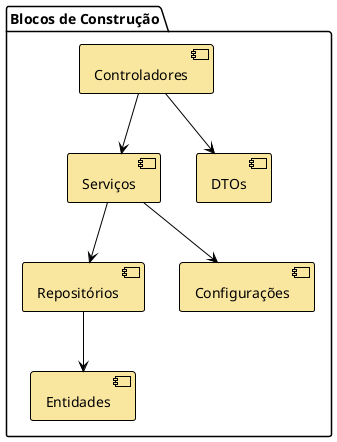

```plantuml:md-blocos-construcao
@startuml
!define BACKGROUND_COLOR #FEF9EF
!define BLOCK_COLOR #F9E79F
!define TEXT_COLOR #000000

skinparam component {
    BackgroundColor BLOCK_COLOR
    BorderColor #000000
    FontColor TEXT_COLOR
    ArrowColor #000000
    BorderThickness 1
}

package "Blocos de Construção" {
    [Controladores]
    [Serviços]
    [Repositórios]
    [Entidades]
    [DTOs]
    [Configurações]
}

[Controladores] --> [Serviços]
[Serviços] --> [Repositórios]
[Repositórios] --> [Entidades]
[Controladores] --> [DTOs]
[Serviços] --> [Configurações]

@enduml
```
