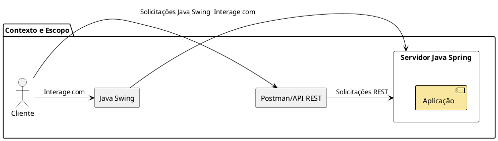

```plantuml:md-contexto-escopo
@startuml
!define BACKGROUND_COLOR #FEF9EF
!define CONTAINER_COLOR #F9E79F
!define TEXT_COLOR #000000

skinparam component {
    BackgroundColor CONTAINER_COLOR
    BorderColor #000000
    FontColor TEXT_COLOR
    ArrowColor #000000
    BorderThickness 1
}

package "Contexto e Escopo" {
    actor "Cliente" as Cliente
    rectangle "Postman/API REST" as API
    rectangle "Java Swing" as SwingApp
    rectangle "Servidor Java Spring" as Server {
        [Aplicação]
    }
}

Cliente -> API : Interage com
Cliente -> SwingApp : Interage com
API -> Server : Solicitações REST
SwingApp -> Server : Solicitações Java Swing

@enduml
```
