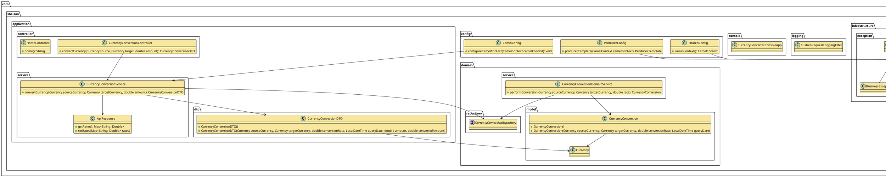

```plantuml:md-diagrama-classe
@startuml 

!define BACKGROUND_COLOR #FEF9EF
!define BLOCK_COLOR #F9E79F
!define TEXT_COLOR #000000

skinparam class {
    BackgroundColor BLOCK_COLOR
    BorderColor #000000
    FontColor TEXT_COLOR
    ArrowColor #000000
    BorderThickness 1
}

package "com.shelson.application.controller" {
    class CurrencyConversionController {
        +convertCurrency(Currency source, Currency target, double amount): CurrencyConversionDTO
    }
    class HomeController {
        +home(): String
    }
}

package "com.shelson.application.dto" {
    class CurrencyConversionDTO {
        +CurrencyConversionDTO()
        +CurrencyConversionDTO(Currency sourceCurrency, Currency targetCurrency, double conversionRate, LocalDateTime queryDate, double amount, double convertedAmount)
    }
}

package "com.shelson.application.service" {
    class CurrencyConversionService {
        +convertCurrency(Currency sourceCurrency, Currency targetCurrency, double amount): CurrencyConversionDTO
    }
    class ApiResponse {
        +getRates(): Map<String, Double>
        +setRates(Map<String, Double> rates)
    }
}

package "com.shelson.domain.model" {
    class Currency
    class CurrencyConversion {
        +CurrencyConversion()
        +CurrencyConversion(Currency sourceCurrency, Currency targetCurrency, double conversionRate, LocalDateTime queryDate)
    }
}

package "com.shelson.domain.repository" {
    interface CurrencyConversionRepository
}

package "com.shelson.domain.service" {
    class CurrencyConversionDomainService {
        +performConversion(Currency sourceCurrency, Currency targetCurrency, double rate): CurrencyConversion
    }
}

package "com.shelson.infrastructure.exception" {
    class BusinessException extends RuntimeException
    class ResourceNotFoundException extends RuntimeException
}

package "com.shelson.logging" {
    class CustomRequestLoggingFilter
}

package "com.shelson.console" {
    class CurrencyConverterConsoleApp
}

package "com.shelson.config" {
    class CamelConfig {
        +configureCamelContext(CamelContext camelContext): void
    }
    class ProducerConfig {
        +producerTemplate(CamelContext camelContext): ProducerTemplate
    }
    class SharedConfig {
        +camelContext(): CamelContext
    }
}

' Relationships
CurrencyConversionController --> CurrencyConversionService
CurrencyConversionService --> CurrencyConversionDTO
CurrencyConversionService --> CurrencyConversionRepository
CurrencyConversionService --> ApiResponse
CurrencyConversionDTO --> Currency
CurrencyConversion --> Currency
CurrencyConversionDomainService --> CurrencyConversionRepository
CurrencyConversionDomainService --> CurrencyConversion
CamelConfig --> CurrencyConversionService
ProducerConfig --> CamelContext
SharedConfig --> CamelContext

@enduml

```
