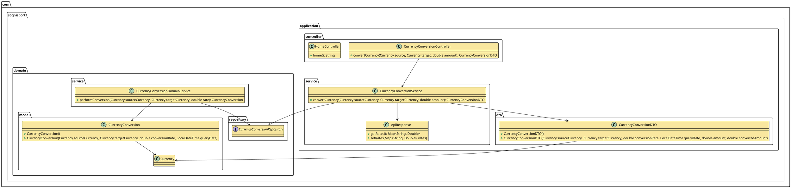

```plantuml:md-diagrama-classe
@startuml

!define BACKGROUND_COLOR #FEF9EF
!define BLOCK_COLOR #F9E79F
!define TEXT_COLOR #000000

skinparam class {
    BackgroundColor BLOCK_COLOR
    BorderColor #000000
    FontColor TEXT_COLOR
    ArrowColor #000000
    BorderThickness 1
}

package "com.sognisport.application.controller" {
    class CurrencyConversionController {
        +convertCurrency(Currency source, Currency target, double amount): CurrencyConversionDTO
    }
    class HomeController {
        +home(): String
    }
}

package "com.sognisport.application.dto" {
    class CurrencyConversionDTO {
        +CurrencyConversionDTO()
        +CurrencyConversionDTO(Currency sourceCurrency, Currency targetCurrency, double conversionRate, LocalDateTime queryDate, double amount, double convertedAmount)
    }
}

package "com.sognisport.application.service" {
    class CurrencyConversionService {
        +convertCurrency(Currency sourceCurrency, Currency targetCurrency, double amount): CurrencyConversionDTO
    }
    class ApiResponse {
        +getRates(): Map<String, Double>
        +setRates(Map<String, Double> rates)
    }
}

package "com.sognisport.domain.model" {
    class Currency
    class CurrencyConversion {
        +CurrencyConversion()
        +CurrencyConversion(Currency sourceCurrency, Currency targetCurrency, double conversionRate, LocalDateTime queryDate)
    }
}

package "com.sognisport.domain.repository" {
    interface CurrencyConversionRepository
}

package "com.sognisport.domain.service" {
    class CurrencyConversionDomainService {
        +performConversion(Currency sourceCurrency, Currency targetCurrency, double rate): CurrencyConversion
    }
}

' Relationships
CurrencyConversionController --> CurrencyConversionService
CurrencyConversionService --> CurrencyConversionDTO
CurrencyConversionService --> CurrencyConversionRepository
CurrencyConversionService --> ApiResponse
CurrencyConversionDTO --> Currency
CurrencyConversion --> Currency
CurrencyConversionDomainService --> CurrencyConversionRepository
CurrencyConversionDomainService --> CurrencyConversion

@enduml
```
