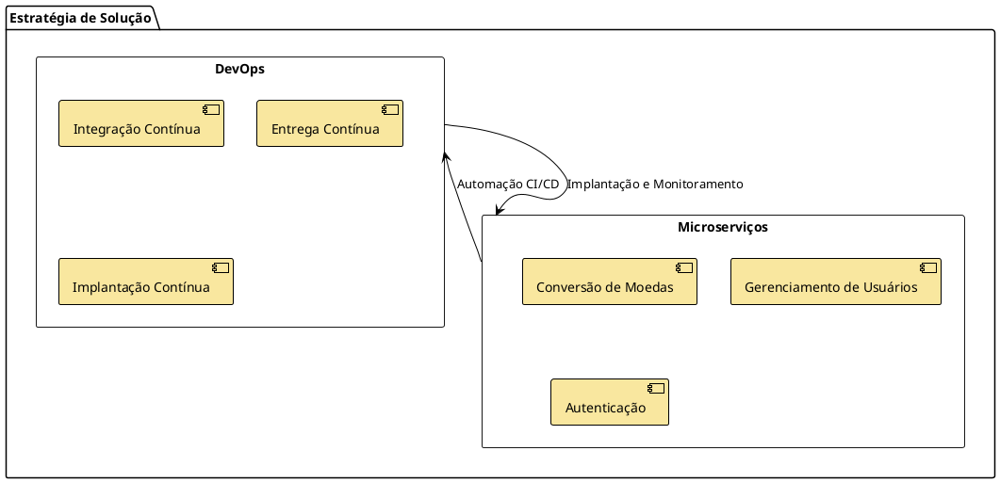

```plantuml:md-estrategia-solucao
@startuml
!define BACKGROUND_COLOR #FEF9EF
!define CONTAINER_COLOR #F9E79F
!define TEXT_COLOR #000000

skinparam component {
    BackgroundColor CONTAINER_COLOR
    BorderColor #000000
    FontColor TEXT_COLOR
    ArrowColor #000000
    BorderThickness 1
}

package "Estratégia de Solução" {
    rectangle "Microserviços" as Microservices {
        [Conversão de Moedas]
        [Gerenciamento de Usuários]
        [Autenticação]
    }
    rectangle "DevOps" as DevOps {
        [Integração Contínua]
        [Entrega Contínua]
        [Implantação Contínua]
    }
}

Microservices -> DevOps: Automação CI/CD
DevOps --> Microservices: Implantação e Monitoramento

@enduml
```
