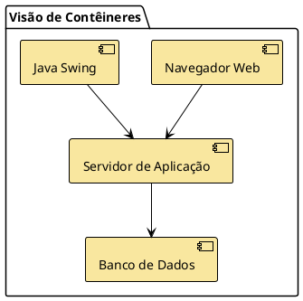

```plantuml:md-visao-containeres
@startuml
!define BACKGROUND_COLOR #FEF9EF
!define CONTAINER_COLOR #F9E79F
!define TEXT_COLOR #000000

skinparam component {
    BackgroundColor CONTAINER_COLOR
    BorderColor #000000
    FontColor TEXT_COLOR
    ArrowColor #000000
    BorderThickness 1
}

package "Visão de Contêineres" {
    [Navegador Web] 
    [Servidor de Aplicação] 
    [Banco de Dados] 
    [Java Swing]
}

[Navegador Web] --> [Servidor de Aplicação]
[Servidor de Aplicação] --> [Banco de Dados]
[Java Swing] --> [Servidor de Aplicação]

@enduml
```
