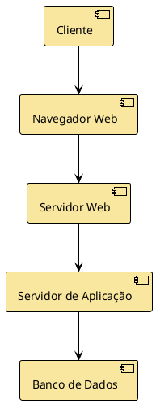

```plantuml:md-visao-implantacao
@startuml
!define BACKGROUND_COLOR #FEF9EF
!define BLOCK_COLOR #F9E79F
!define TEXT_COLOR #000000

skinparam component {
    BackgroundColor BLOCK_COLOR
    BorderColor #000000
    FontColor TEXT_COLOR
    ArrowColor #000000
    BorderThickness 1
}

[Cliente] --> [Navegador Web]
[Navegador Web] --> [Servidor Web]
[Servidor Web] --> [Servidor de Aplicação]
[Servidor de Aplicação] --> [Banco de Dados]

@enduml
```

